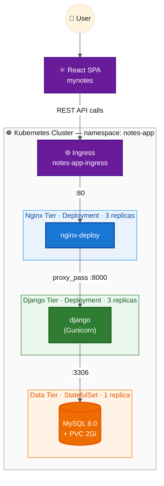
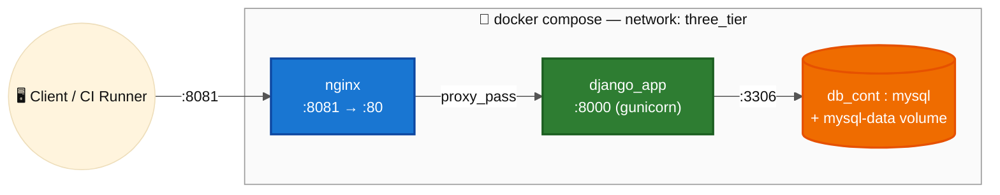
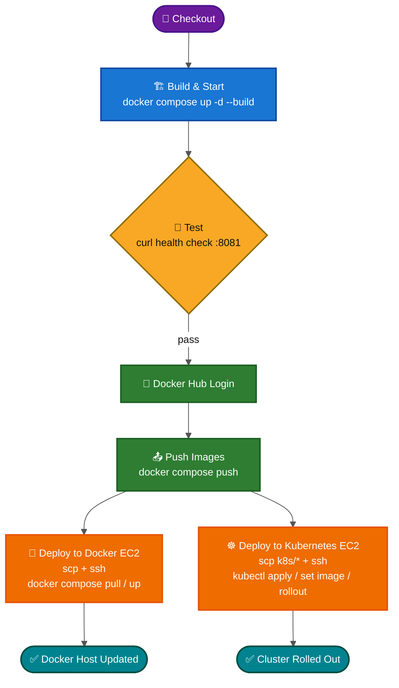
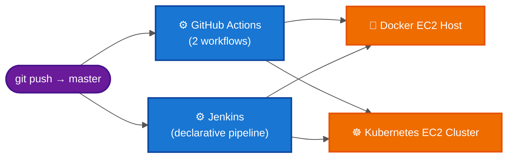

<div align="center">

# 📝 Django Notes App — End-to-End DevOps Pipeline

### Containerized · Orchestrated on Kubernetes · Shipped through two parallel CI/CD pipelines

[](https://www.docker.com/)
[](https://kubernetes.io/)
[](https://www.jenkins.io/)
[](https://github.com/features/actions)
[](https://aws.amazon.com/ec2/)
[](https://www.djangoproject.com/)
[](https://www.mysql.com/)
[](https://www.nginx.com/)

</div>

---

## 📌 Overview

This repository documents a complete **DevOps engineering exercise**: taking an existing 3-tier Notes application (Django REST API + React frontend + MySQL) and building the entire delivery pipeline around it — from containers to cluster to continuous deployment.

The application code itself isn't the point of this project — the infrastructure and automation around it is. This repo covers:

- **Containerizing** every tier of the app (Django backend, Nginx reverse proxy, MySQL database)
- **Orchestrating locally** with Docker Compose for fast builds and CI smoke-testing
- **Orchestrating at scale** with hand-written Kubernetes manifests — Deployments, a StatefulSet, Services, Secrets, a ConfigMap, and an Ingress
- **Automating delivery** with **two independent, functionally equivalent CI/CD pipelines** — GitHub Actions and Jenkins — each deploying to two different targets: a plain Docker EC2 host and a Kubernetes EC2 cluster
- **Deploying to real AWS infrastructure**, not just local sandboxes

---

## 🏗️ Architecture

### Kubernetes Production Architecture



### Docker Compose Architecture (Local Build & CI Smoke Test)



### CI/CD Pipeline Flow



### Dual-Tool, Dual-Target Delivery



> All diagrams above use explicit fill/stroke/text colors on every node and subgraph, so they render with full contrast regardless of whether you're viewing GitHub in light or dark mode.

---

## 🧰 Tech Stack

| Layer | Technology |
|---|---|
| **Backend** | Django, Django REST Framework, Gunicorn |
| **Frontend** | React (Create React App) |
| **Database** | MySQL 8.0 |
| **Reverse Proxy** | Nginx |
| **Containerization** | Docker, Docker Compose |
| **Orchestration** | Kubernetes (Deployments, StatefulSet, Services, Secrets, ConfigMap, Ingress) |
| **CI/CD** | Jenkins (declarative pipeline) & GitHub Actions (dual workflows) |
| **Cloud** | AWS EC2 (Docker host + Kubernetes host) |
| **Image Registry** | Docker Hub |

---

## 📁 Project Structure

```text
django-notes-app-DevOps/
├── api/                      # Django REST app — models, serializers, views, urls
├── notesapp/                 # Django project — settings, urls, wsgi/asgi
├── mynotes/                  # React frontend (build + src + its own Dockerfile)
├── nginx/                    # Nginx Dockerfile + default.conf (reverse proxy config)
├── k8s/                       # Kubernetes manifests
│   ├── namespace.yaml
│   ├── ingress.yaml
│   ├── django/                # Deployment, Secret, Service
│   ├── mysql/                 # StatefulSet, Secret, Service
│   └── nginx/                 # Deployment, ConfigMap, Service
├── .github/workflows/         # GitHub Actions pipelines (Docker EC2 + Kubernetes EC2)
├── Jenkinsfile                 # Jenkins declarative pipeline (Docker EC2 + Kubernetes EC2)
├── Dockerfile                  # Django app image
├── compose.yaml               # Docker Compose — nginx + django_app + db
├── Procfile                    # Process definition
├── requirements.txt
├── manage.py
└── Outputs/                   # Screenshots of pipeline runs on real infrastructure
```

---

## 🚀 Running & Deploying This Project

### Prerequisites

- Docker & Docker Compose installed
- `kubectl` installed and pointed at a Kubernetes cluster (for the K8s path)
- A Docker Hub account (for pushing/pulling images)
- SSH access to your target EC2 instance(s)

### 1. Clone the repository

```bash
git clone https://github.com/<your-username>/django-notes-app-DevOps.git
cd django-notes-app-DevOps
```

### 2. Configure environment variables

The Docker Compose stack reads these from the shell environment (Jenkins/GitHub Actions inject them from stored credentials at pipeline time — for a manual local run, export them yourself):

```bash
export DOCKERHUB_USERNAME=<your-dockerhub-username>
export DB_NAME=test_db
export DB_USER=root
export DB_PASSWORD=<your-db-password>
export DB_PORT=3306
export DB_HOST=db_cont
export MYSQL_ROOT_PASSWORD=<your-mysql-root-password>
export MYSQL_DATABASE=test_db
```

### 3. Build and run locally with Docker Compose

```bash
docker compose up -d --build
docker compose ps          # confirm all 3 containers are healthy/running
curl -f http://localhost:8081   # sanity check — should return the app response
```

The app is now reachable at **http://localhost:8081**.

Tear it down when you're done:

```bash
docker compose down -v
```

### 4. Push images to Docker Hub

```bash
docker login
docker compose push
```

### 5. Deploy manually to a Docker host (EC2)

```bash
scp compose.yaml ubuntu@<DOCKER_EC2_IP>:/home/ubuntu/Docker-django-notes-app/
ssh ubuntu@<DOCKER_EC2_IP>
  cd Docker-django-notes-app
  docker compose pull
  docker compose up -d --remove-orphans
  docker compose ps
```

### 6. Deploy manually to Kubernetes

```bash
# Copy manifests to the cluster host if applying remotely
scp -r k8s/* ubuntu@<K8S_EC2_IP>:/home/ubuntu/k8s/

# On the cluster host (or locally if kubectl already points at the cluster)
kubectl apply -f k8s/namespace.yaml
kubectl apply -f k8s/ -R

kubectl get pods -n notes-app
kubectl get services -n notes-app
kubectl get ingress -n notes-app
```

> Update the `image:` fields in `k8s/django/deployment.yaml` and `k8s/nginx/deployment.yaml` to your own Docker Hub repositories first, or let the CI/CD pipeline do it automatically via `kubectl set image`.

### 7. Let CI/CD do all of the above automatically

Rather than running steps 3–6 by hand every time, push to `master` and let the pipelines handle build → test → push → deploy:

**Jenkins** — configure these credentials in Jenkins before the first run:

| Credential ID | Type | Used for |
|---|---|---|
| `DOCKERHUB_USERNAME` | Secret text | Image namespace |
| `dockerhub-credentials` | Username/password | Docker Hub login |
| `mysql-root-password` | Secret text | MySQL root password |
| `db-password` | Secret text | Django DB password |
| `docker-server` | SSH username + private key | Docker EC2 access |
| `kubernetes-server` | SSH username + private key | Kubernetes EC2 access |

Then just point a Jenkins pipeline job at this repo's `Jenkinsfile` and trigger a build (manually or via a webhook on push to `master`).

**GitHub Actions** — add the equivalent secrets under **Settings → Environments** for `Docker-hub-login-credentials`, `AWS_CREDENTIALS`, and `k8s-server-credentials`, matching the secret names referenced in `.github/workflows/*.yml` (`DOCKERHUB_USERNAME`, `DOCKERHUB_PASSWORD`, `DB_*`, `MYSQL_*`, `EC_HOST`, `EC_SSH_KEY`, `K8S_SERVER`, `K8S_SERVER_KEY`). Once set, every push to `master` triggers both workflows automatically.

---

## ⚙️ How It Works

### Containerization

| Image | Built from | Purpose |
|---|---|---|
| `docker-django-notes-app-django_app` | `Dockerfile` | Runs the Django app with Gunicorn on port `8000` |
| `django-nginx` | `nginx/Dockerfile` | Reverse proxy in front of Django, listens on port `80` |
| MySQL | Official `mysql:8.0` image | Persistent data tier |

The Django `Dockerfile` installs the system build dependencies (`gcc`, `default-libmysqlclient-dev`, `pkg-config`) required to compile `mysqlclient`, then installs Python dependencies from `requirements.txt`.

### Local Orchestration — Docker Compose

`compose.yaml` wires the three services together on a shared `three_tier` bridge network:

- **`db`** — MySQL, with a named volume (`mysql-data`) for persistence and a healthcheck gate.
- **`django_app`** — waits for MySQL to be `service_healthy`, runs migrations automatically (`python manage.py migrate --noinput`), then starts Gunicorn.
- **`nginx`** — depends on `django_app`, proxies external traffic on host port `8081` to Django's `8000`.

This exact stack is what gets spun up during CI to smoke-test the build before anything is pushed or deployed.

### Cluster Orchestration — Kubernetes

The `k8s/` manifests define a dedicated `notes-app` namespace containing:

| Resource | Kind | Notes |
|---|---|---|
| `django` | `Deployment` (3 replicas) | Pulls secrets via `envFrom.secretRef`, liveness/readiness probes on `/` |
| `django-app-secret` | `Secret` | DB credentials, base64-encoded |
| `django-svc` | `Service` | ClusterIP exposing port `8000` |
| `db` | `StatefulSet` (1 replica) | MySQL 8.0 with a `PersistentVolumeClaim` (`2Gi`), `mysqladmin ping` liveness/readiness probes |
| `db-secret` | `Secret` | MySQL root credentials |
| `db-svc` | `Service` | Backing service for the StatefulSet, port `3306` |
| `nginx-deploy` | `Deployment` (3 replicas) | Nginx reverse proxy, config mounted from a `ConfigMap` |
| `nginx-config` | `ConfigMap` | Injects `default.conf`, proxies to `django-svc:8000` |
| `frontend-svc` | `Service` | ClusterIP exposing port `80`, fronted by the Ingress |
| `notes-app-ingress` | `Ingress` | Routes external traffic (`/`) to `frontend-svc` via the `nginx` IngressClass |

Everything is namespace-scoped, horizontally replicated where it should be (stateless Django/Nginx tiers), and stateful where it must be (MySQL, via `StatefulSet` + `PVC`).

---

## 🔄 CI/CD Pipelines

Two independent, functionally equivalent pipelines were built to compare and practice both ecosystems. Each has **two deployment targets**: a plain Docker EC2 host and a Kubernetes EC2 cluster (see the "Dual-Tool, Dual-Target Delivery" diagram above).

### 🧩 Jenkins (`Jenkinsfile`)

A declarative pipeline using `withCredentials` to inject Jenkins-managed secrets (Docker Hub creds, MySQL/DB passwords, SSH keys for both EC2 targets) at each stage, keeping nothing hardcoded in source control.

Stages: **Checkout → Build & Start → Test → Docker Hub Login → Push Images → Deploy to Docker EC2 → Deploy to Kubernetes EC2**, with a `post { always { docker compose down -v } }` cleanup block so the Jenkins agent never ends up with stale containers or volumes.

Both deploy stages `scp` the required files to the target EC2 host, then run the deployment commands over `ssh` using a quoted heredoc (`<< 'EOF'`) with credentials passed explicitly into the remote shell's environment — this avoids the classic pitfall of local (Jenkins-side) variable expansion silently emptying out variables meant to be evaluated on the remote host.

### 🧩 GitHub Actions (`.github/workflows/`)

Two workflows, each modeled as three jobs — `ci → push → cd` — using GitHub **Environments** to scope secrets:

1. **`ci`** — builds all images via `docker compose build`, boots the full stack, verifies containers are running, and tears everything down (`docker compose logs` on failure for debuggability).
2. **`push`** — logs in to Docker Hub (`docker/login-action`) and pushes the built images.
3. **`cd`** — copies the deployment artifacts to the target EC2 host via `appleboy/scp-action`, then executes the deployment script via `appleboy/ssh-action`.

- **`Docker to EC2` workflow** → deploys `compose.yaml` to a Docker Compose host and runs `docker compose pull && up -d --remove-orphans`.
- **`Kubernetes EC2` workflow** → deploys the `k8s/` manifests, applies them with `kubectl`, then does a rolling image update (`kubectl set image` + `kubectl rollout status`) for both the Django and Nginx deployments.

---

## 🖥️ Infrastructure

Two dedicated AWS EC2 instances serve as deployment targets:

| Server | Role |
|---|---|
| **Docker EC2** | Runs the full stack via `docker compose` |
| **Kubernetes EC2** | Hosts a Kubernetes cluster (1 control-plane + 2 workers) the app is deployed onto via `kubectl` |

---

## 📸 Pipeline Outputs

> **Why you might not see these images:** they are linked with relative paths into this repo's own `Outputs/` folder. GitHub resolves and renders them automatically once this README and the `Outputs/` folder are both pushed to the same repository — but any tool that doesn't have direct access to your repo's files (chat previews, local Markdown viewers without the folder open, etc.) has no image to load, so it'll show a broken-image icon instead. This is expected and isn't an error in the README itself. To confirm: push the repo, then open the README on GitHub.com directly.

### GitHub Actions — Live Runs

| Docker EC2 Deployment | Docker EC2 Deployment (cont.) |
|---|---|
|  |  |

| Kubernetes EC2 Deployment | Kubernetes EC2 Deployment (cont.) |
|---|---|
|  |  |

### Jenkins — Live Runs

| Docker Server Output | Kubernetes Server Output |
|---|---|
|  |  |

| Kubernetes Server Output (cont.) |
|---|
|  |

---

## 🔐 Environment Variables / Secrets

| Variable | Used By | Purpose |
|---|---|---|
| `DOCKERHUB_USERNAME` | Compose, K8s, both pipelines | Docker Hub namespace for image tags |
| `DB_NAME`, `DB_USER`, `DB_PASSWORD`, `DB_PORT`, `DB_HOST` | Django app | Database connection |
| `MYSQL_ROOT_PASSWORD`, `MYSQL_DATABASE` | MySQL container | DB bootstrap credentials |
| `DOCKERHUB_PASSWORD` / `dockerhub-credentials` | CI/CD | Registry authentication |
| `EC_SSH_KEY` / `docker-server`, `K8S_SERVER_KEY` / `kubernetes-server` | CI/CD | SSH access to deployment targets |

In Kubernetes, the equivalents (`django-app-secret`, `db-secret`) are stored as base64-encoded `Secret` objects — for a real production repo these would be sealed/encrypted (e.g. Sealed Secrets, SOPS, or an external secrets manager) rather than committed as plain base64.

---

## 🗺️ Roadmap / What I'd Improve Next

- [ ] Move plain base64 `Secret` manifests to a proper secrets manager (Sealed Secrets / AWS Secrets Manager)
- [ ] Add Horizontal Pod Autoscaling (HPA) for the Django and Nginx deployments
- [ ] Add a Helm chart to templatize the `k8s/` manifests across environments
- [ ] Add Prometheus + Grafana monitoring and centralized logging
- [ ] Add automated rollback on failed `kubectl rollout status`
- [ ] Migrate to TLS via cert-manager on the Ingress

---

## 👋 About

Built while practicing DevOps end to end — containerizing an existing 3-tier app, designing the Kubernetes manifests, and wiring up two separate CI/CD toolchains against real AWS infrastructure. This repo is a snapshot of that process.

If you're also learning DevOps and have feedback or suggestions, issues and PRs are welcome!
